# Lesson: Digital & Serious Games

### First and Last Name: Evangelia Despotidou
### University Registration Number: dpsd19030
### GitHub Personal Profile: [Evedes01](https://github.com/Evedes01)
### Digital & Serious Games Personal Repository: [Personal RPG Repository](https://github.com/Evedes01/Role-Playing-Game)

# Introduction

# Summary

# 1st Deliverable
Αρχικά, κατέβασ την έκδοση του Unity που χρειάζεται για το tutorial και δημιούργησα ένα νέο 2D Project, το οποίο αποθήκευσα στον φάκελο που δημιούργησα για το παιχνίδι.

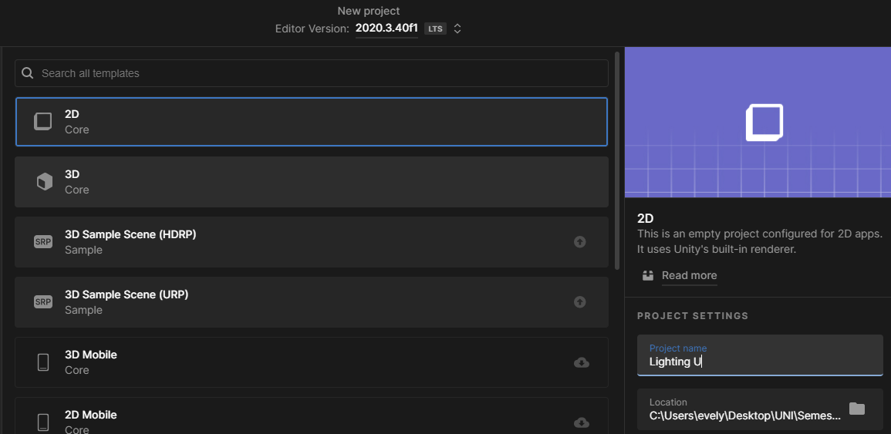

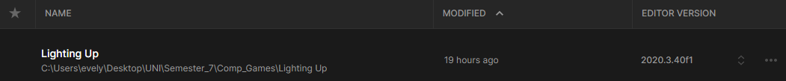

Ξεκινώντας το πρόγραμμα, και ακολουθώντας το tutorial [Ruby’s Adventure]( https://learn.unity.com/tutorial/main-character-and-first-script?uv=2020.3&projectId=5c6166dbedbc2a0021b1bc7c), δημιούργησα μια νέα σκηνή, την ονόμασα “MainScene”, την έσωσα στον φάκελο "Scenes" και στη συνέχεια... 
 
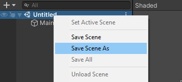 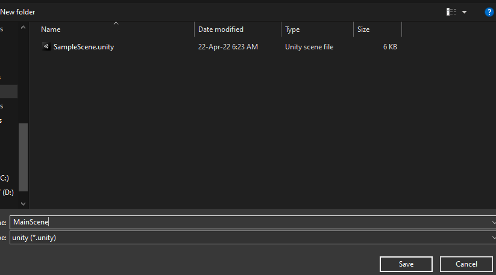

κατέβασα τον χαρακτήρα Ruby. 
Τον μετέφερα με drag-and-drop στον φάκελο _Assets>Art_ που δημιούργησα και τον προσέθεσα στην σκηνή με τον ίδιο τρόπο.

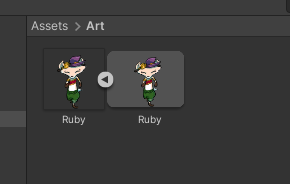 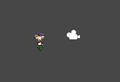

Για την μετακίνηση του χαρακτήρα δημιούργησα έναν νέο φάκελο Scripts, όπου έφτιαξα ένα C# Script αρχείο με όνομα MCControler.

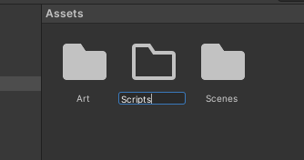 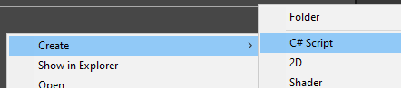

Το άνοιξα στο Visual Studio και αντέγραψα μέσα στην _void Update_ τον κώδικα του tutorial και σιγούρευσα ότι το όνομα του αρχείου είναι το ίδιο με το _public class_. Έσωσα το αρχείο και επέστρεψα στο Unity.

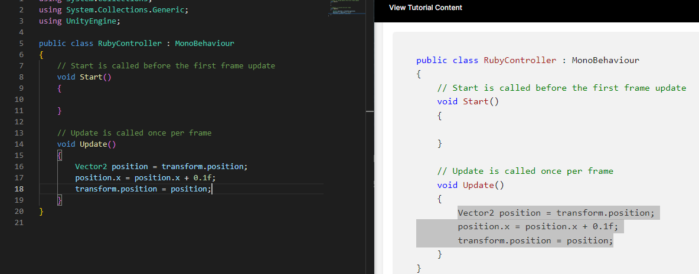

Επιστρέφοντας, επέλεξα τον χαρακτήρα και έκανα drag-and-drop το script στον inspector του. Έβαλα το παιχνίδι να παίξει και ο χαρακτήρας κινήθηκε προς τα δεξιά μέχρι να χαθεί από την κάμερα.

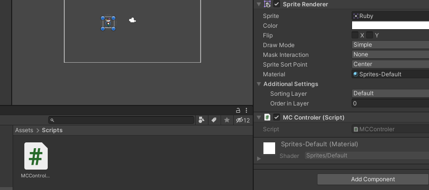

Στο επόμενο βήμα αντικατέστησα τον δοκιμαστικό κώδικα με αυτόν για την κίνηση της Ruby με τα βελάκια ή τα πλήκτρα AWSD. 
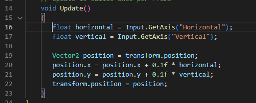

Έσωσα ξανά τον κώδικα και επέστρεψα στο Unity να τον δοκιμάσω. Το script ανανεώθηκα και έτρεξα το παιχνίδι… Τώρα ο χαρακτήρας κινούταν με βάση τα βελάκια του πληκτρολογίου, αλλά με υπερβολική μετακίνηση.

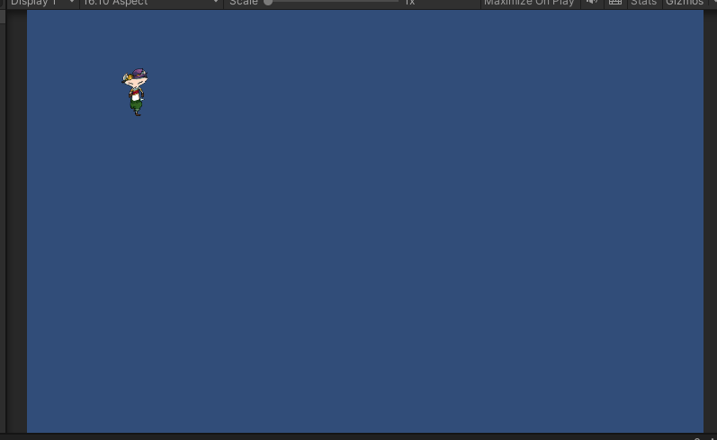

Έτσι, προσάρμοσα τον κώδικα σύμφωνα με το tutorial και κάποιες δοκιμές

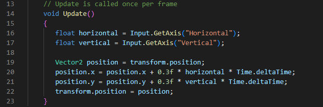

και ξανά έτρεξα το παιχνίδι, διαπιστώνοντας ότι η κίνηση ήταν πολύ καλύτερη.

________________________________________________________

Πριν προχωρήσω στα Tilemaps, αποφάσισα να αντικαταστήσω την Ruby, με τον χαρακτήρα που σχεδίασα... τον Pimo.

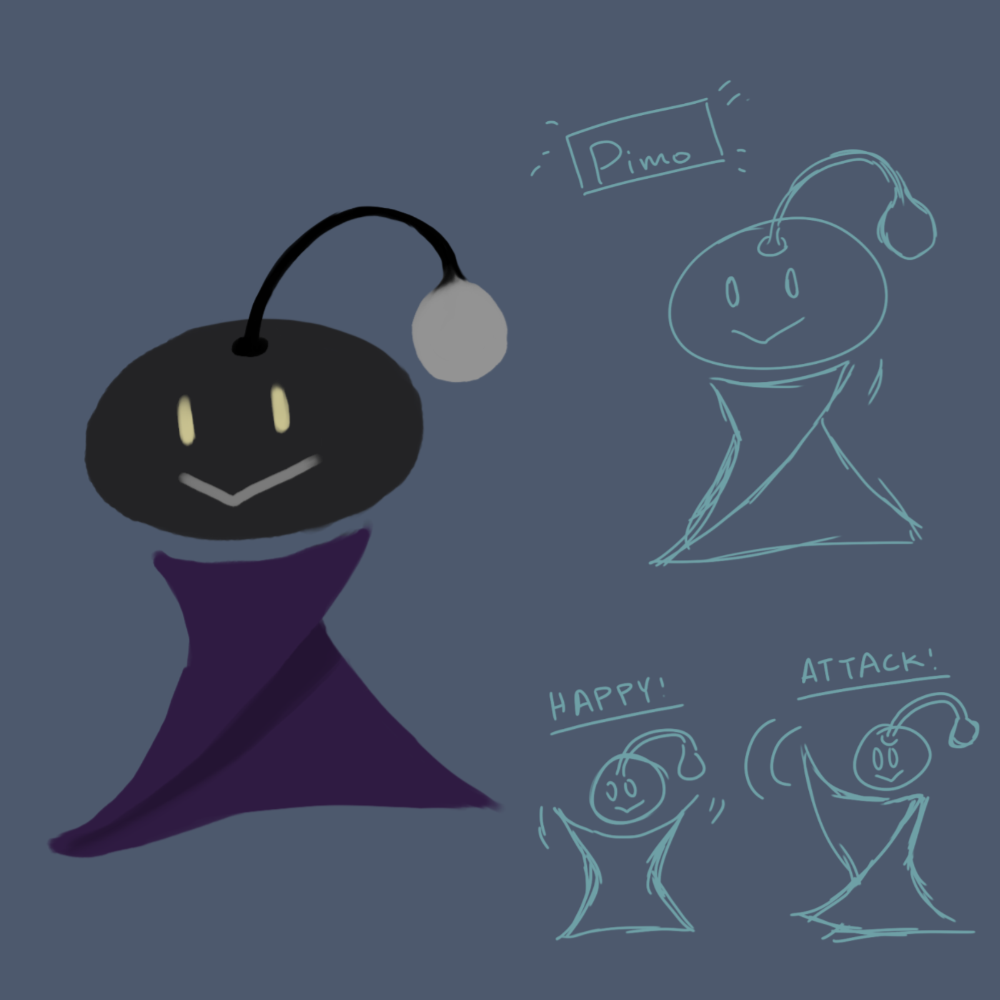

Έτσι, πήγα στο πρόγραμμα, προσέθεσα τον Pimo στον φάκελο _Art>Sprites_ και τον έκανα drag-and-drop στον Sprite Renderer.

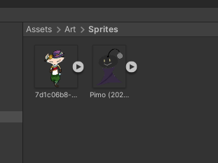 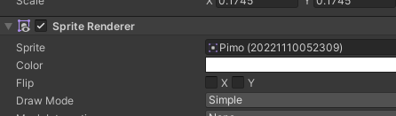

# 2nd Deliverable

# 3rd Deliverable 

# Conclusions

# Sources
