# Lesson: Digital & Serious Games

### First and Last Name: Evangelia Despotidou
### University Registration Number: dpsd19030
### GitHub Personal Profile: [Evedes01](https://github.com/Evedes01)
### Digital & Serious Games Personal Repository: [Personal RPG Repository](https://github.com/Evedes01/Role-Playing-Game)

# Introduction

# Summary

# 1st Deliverable
Αρχικά, κατέβασ την έκδοση του Unity που χρειάζεται για το tutorial και δημιούργησα ένα νέο 2D Project, το οποίο αποθήκευσα στον φάκελο που δημιούργησα για το παιχνίδι.

Ξεκινώντας το πρόγραμμα, και ακολουθώντας το tutorial [Ruby’s Adventure]( https://learn.unity.com/tutorial/main-character-and-first-script?uv=2020.3&projectId=5c6166dbedbc2a0021b1bc7c), δημιούργησα μια νέα σκηνή, την ονόμασα “MainScene”, την έσωσα στον φάκελο "Scenes" και στη συνέχεια... 
 
 

κατέβασα τον χαρακτήρα Ruby. 
Τον μετέφερα με drag-and-drop στον φάκελο _Assets>Art_ που δημιούργησα και τον προσέθεσα στην σκηνή με τον ίδιο τρόπο.

 

Για την μετακίνηση του χαρακτήρα δημιούργησα έναν νέο φάκελο Scripts, όπου έφτιαξα ένα C# Script αρχείο με όνομα MCControler.

 

Το άνοιξα στο Visual Studio και αντέγραψα μέσα στην _void Update_ τον κώδικα του tutorial και σιγούρευσα ότι το όνομα του αρχείου είναι το ίδιο με το _public class_. Έσωσα το αρχείο και επέστρεψα στο Unity.

Επιστρέφοντας, επέλεξα τον χαρακτήρα και έκανα drag-and-drop το script στον inspector του. Έβαλα το παιχνίδι να παίξει και ο χαρακτήρας κινήθηκε προς τα δεξιά μέχρι να χαθεί από την κάμερα.

Στο επόμενο βήμα αντικατέστησα τον δοκιμαστικό κώδικα με αυτόν για την κίνηση της Ruby με τα βελάκια ή τα πλήκτρα AWSD. 

Έσωσα ξανά τον κώδικα και επέστρεψα στο Unity να τον δοκιμάσω. Το script ανανεώθηκα και έτρεξα το παιχνίδι… Τώρα ο χαρακτήρας κινούταν με βάση τα βελάκια του πληκτρολογίου, αλλά με υπερβολική μετακίνηση.

Έτσι, προσάρμοσα τον κώδικα σύμφωνα με το tutorial και κάποιες δοκιμές

και ξανά έτρεξα το παιχνίδι, διαπιστώνοντας ότι η κίνηση ήταν πολύ καλύτερη.

 

Πριν προχωρήσω στα Tilemaps, αποφάσισα να αντικαταστήσω την Ruby, με τον χαρακτήρα που σχεδίασα... τον Pimo.

Έτσι, πήγα στο πρόγραμμα, προσέθεσα τον Pimo στον φάκελο _Art>Sprites_ και τον έκανα drag-and-drop στον Sprite Renderer.

 

Tilemaps:

 

Στην ιεραρχία προσέθεσα ένα 2D Rectangular Tilemap 

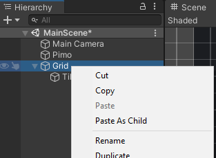 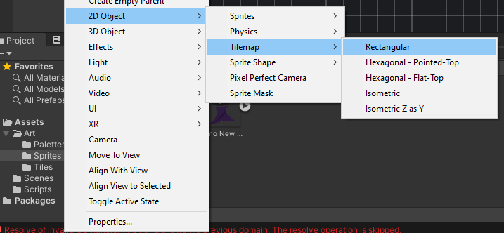

και στη συνέχεια άνοιξα το Tile Palette από το Window, για να μπορώ να βάλω και να επεξεργαστώ τα διάφορα tiles, που αποτελούν το περιβάλλον. Δημιούργησα μια καινούρια παλέτα με το όνομα “Ground” και την αποθήκευσα σε νέο φάκελο “Palettes”.

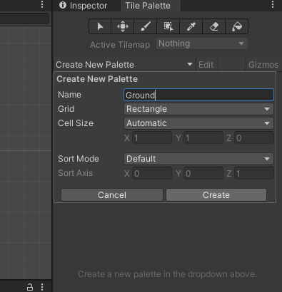 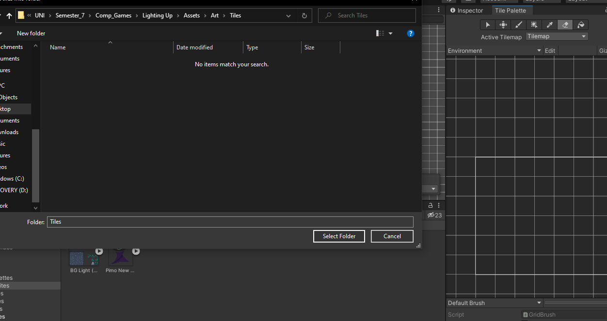

Συνεχίζοντας με το World Design, σχεδίασα το έδαφος υπολογίζοντας τα κουτιά του grid και εισήγαγα την εικόνα στο Unity, στον φάκελο Sprites που δημιούργησα. 
Για αυτό το κομμάτι ακολούθησα ένα άλλο [video tutorial](https://www.youtube.com/watch?v=DTp5zi8_u1U&ab_channel=Velvary), καθώς η πλατφόρμα έχει διαφοροποιηθεί σε σχέση με το αρχικό tutorial.
Μετά από αυτό, την επεξεργάστηκα θέτοντας το Sprite Mode στο Multiple 

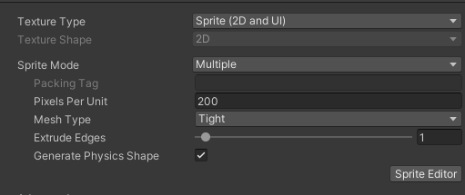

και άνοιξα τον Sprite Editor για να την χωρίσω σε κομμάτια/κουτιά για το grid. Κάνοντας Slice την εικόνα και δοκιμάζοντας διάφορες τιμές ως Cell Size (Type), χτυπώντας Apply είχε ως αποτέλεσμα την παρακάτω εικόνα. 

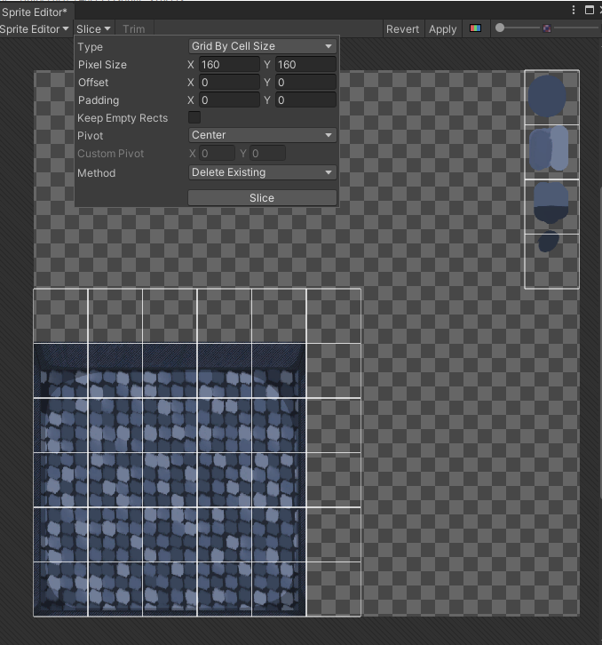

Διέγραψα τα κουτιά που δεν χρειαζόντουσαν και πάτησα Apply για να αποθηκευτεί η αλλαγή.

 Για τη σύνθεση έσυρα την τεμαχισμένη πλέον εικόνα στο Tile Palette, και άρχισα να χτίζω το περιβάλλον με τα κουτιά. 

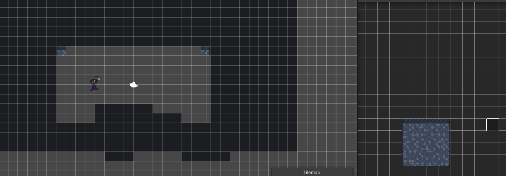

Αφού τελείωσα με αυτό, προσέθεσα στο σχέδιο, σε πρόγραμμα ζωγραφικής, διάφορες διακοσμητικές λεπτομέρειες και ανανέωσα την εικόνα ακολουθώντας την προηγούμενη διαδικασία, 

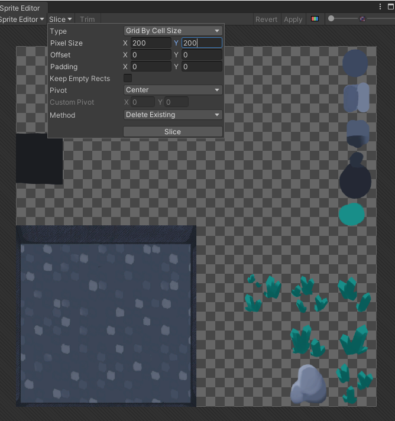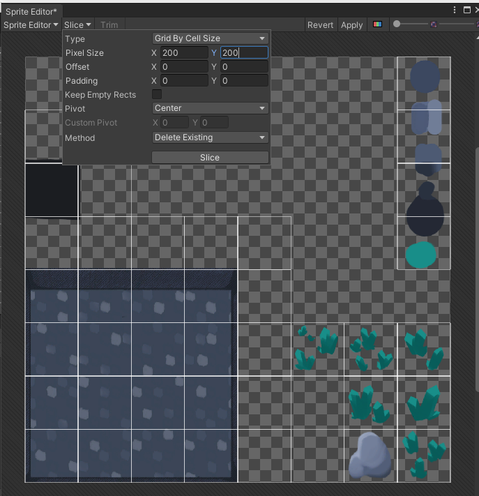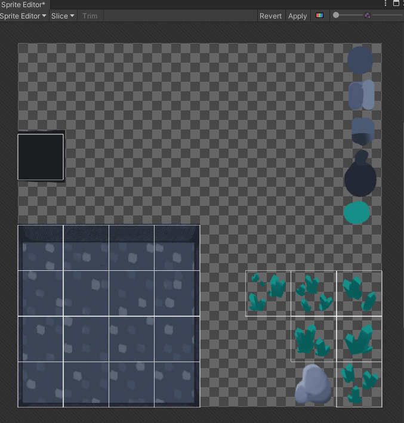

ενώ προσέθεσα καινούρια παλέτα “Deco” συγκεκριμένα για τη διακόσμηση… Με αυτό τον τρόπο προσέθεσα καινούρια στοιχεία χωρίς να πειράξω τον από κάτω χάρτη.

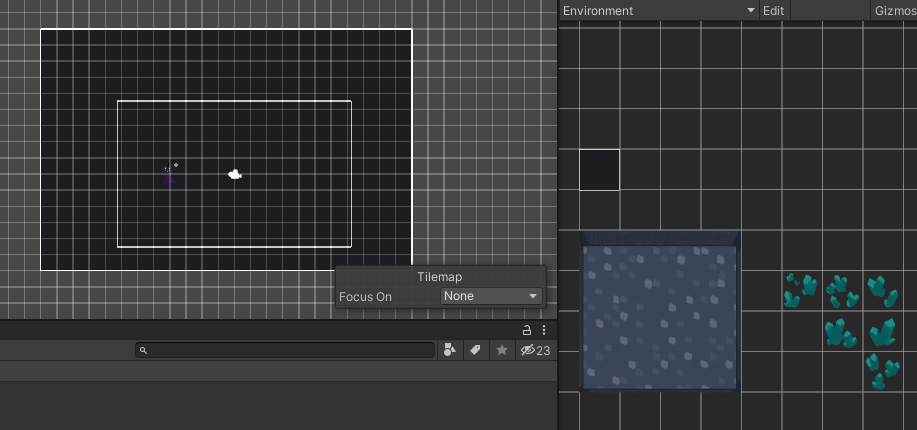 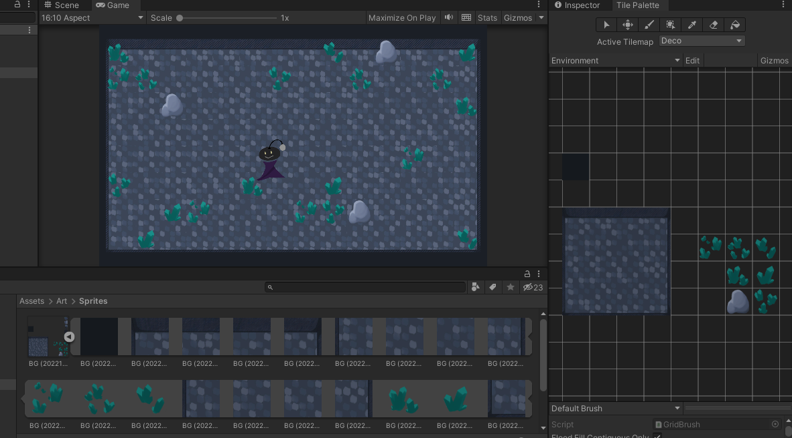

  

Το επόμενο και τελευταίο βήμα ήταν να κάνω το πρόγραμμα Build and Run.
Αφού έκανα τις απαραίτητες αλλαγές στο _Project Settings…>Player_, έκανα το παιχνίδι Build and Run σε WebGL.

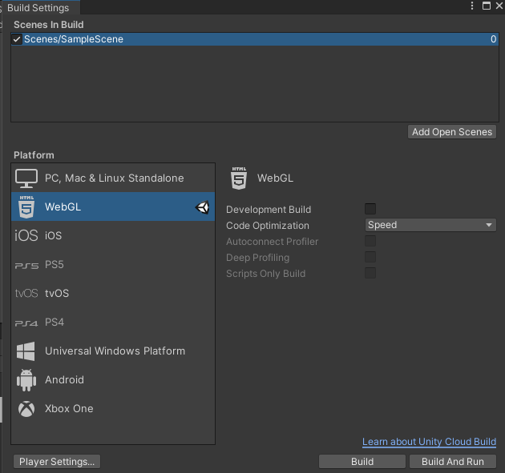

Ανέβασα τους τρεις αναγκαίους φακέλους/αρχεία στο GitHub, και πατώντας το [link](https://evedes01.github.io/Role-Playing-Game/) εμφανιζόταν το παιχνίδι, αλλά αντί για τον χάρτη είχε μπλε οθόνη.
 
Τη λύση τη βρήκα σε αυτό το [link]( https://forum.unity.com/threads/webgl-build-gives-a-blue-screen.914222/), όπου τελικά φάνηκε ότι δεν είχε επιλεχθεί η σωστή σκηνή για να γίνει build, την οποία στη συνέχεια επέλεξα ("MainScene"). Επίσης, χρειάζονταν Sorting Layers. Δημιούργησα τα layers “BG” και “Player”, και ένταξα τον πρωταγωνιστή στο Player και το περιβάλλον στο BG.

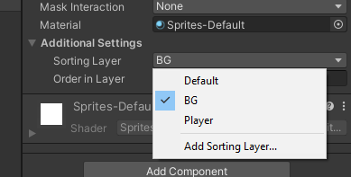

Τέλος άλλαξα τον αριθμό στο Order in Layer”, ξανά έκανα Build and Run και αυτή τη φορά ανεβάζοντάς το στο GitHub, το παιχνίδι έπαιξε κανονικά!

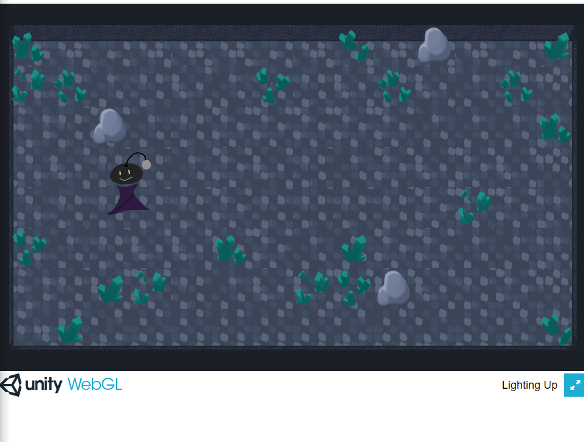

(Η αισθητική του παιχνιδιού και των asset εξελισσόταν κατά τη διάρκεια της υλοποίησης και θα εξακολουθεί να εξελίσσεται.)

# 2nd Deliverable

# 3rd Deliverable 

# Conclusions

# Sources
