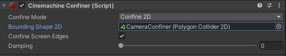
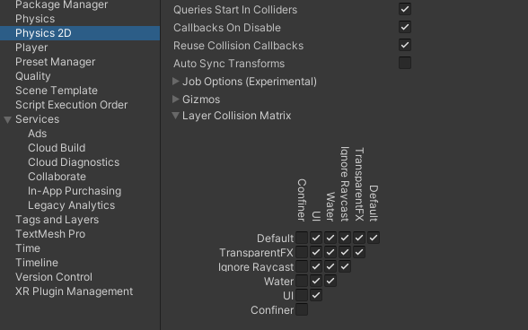

# Lesson: Digital & Serious Games

### First and Last Name: Evangelia Despotidou
### University Registration Number: dpsd19030
### GitHub Personal Profile: [Evedes01](https://github.com/Evedes01)
### Digital & Serious Games Personal Repository: [Personal RPG Repository](https://github.com/Evedes01/Role-Playing-Game)

# Introduction

# Summary

# 1st Deliverable
Αρχικά, κατέβασ την έκδοση του Unity που χρειάζεται για το tutorial και δημιούργησα ένα νέο 2D Project, το οποίο αποθήκευσα στον φάκελο που δημιούργησα για το παιχνίδι.

Ξεκινώντας το πρόγραμμα, και ακολουθώντας το tutorial [Ruby’s Adventure]( https://learn.unity.com/tutorial/main-character-and-first-script?uv=2020.3&projectId=5c6166dbedbc2a0021b1bc7c), δημιούργησα μια νέα σκηνή, την ονόμασα “MainScene”, την έσωσα στον φάκελο "Scenes" και στη συνέχεια... 
 
 

κατέβασα τον χαρακτήρα Ruby. 
Τον μετέφερα με drag-and-drop στον φάκελο _Assets>Art_ που δημιούργησα και τον προσέθεσα στην σκηνή με τον ίδιο τρόπο.

 

Για την μετακίνηση του χαρακτήρα δημιούργησα έναν νέο φάκελο Scripts, όπου έφτιαξα ένα C# Script αρχείο με όνομα MCControler.

 

Το άνοιξα στο Visual Studio και αντέγραψα μέσα στην _void Update_ τον κώδικα του tutorial και σιγούρευσα ότι το όνομα του αρχείου είναι το ίδιο με το _public class_. Έσωσα το αρχείο και επέστρεψα στο Unity.

Επιστρέφοντας, επέλεξα τον χαρακτήρα και έκανα drag-and-drop το script στον inspector του. Έβαλα το παιχνίδι να παίξει και ο χαρακτήρας κινήθηκε προς τα δεξιά μέχρι να χαθεί από την κάμερα.

Στο επόμενο βήμα αντικατέστησα τον δοκιμαστικό κώδικα με αυτόν για την κίνηση της Ruby με τα βελάκια ή τα πλήκτρα AWSD. 

Έσωσα ξανά τον κώδικα και επέστρεψα στο Unity να τον δοκιμάσω. Το script ανανεώθηκα και έτρεξα το παιχνίδι… Τώρα ο χαρακτήρας κινούταν με βάση τα βελάκια του πληκτρολογίου, αλλά με υπερβολική μετακίνηση.

Έτσι, προσάρμοσα τον κώδικα σύμφωνα με το tutorial και κάποιες δοκιμές

και ξανά έτρεξα το παιχνίδι, διαπιστώνοντας ότι η κίνηση ήταν πολύ καλύτερη.

 

Πριν προχωρήσω στα Tilemaps, αποφάσισα να αντικαταστήσω την Ruby, με τον χαρακτήρα που σχεδίασα... τον Pimo.

Έτσι, πήγα στο πρόγραμμα, προσέθεσα τον Pimo στον φάκελο _Art>Sprites_ και τον έκανα drag-and-drop στον Sprite Renderer.

 

Tilemaps:

 

Στην ιεραρχία προσέθεσα ένα 2D Rectangular Tilemap 

 

και στη συνέχεια άνοιξα το Tile Palette από το Window, για να μπορώ να βάλω και να επεξεργαστώ τα διάφορα tiles, που αποτελούν το περιβάλλον. Δημιούργησα μια καινούρια παλέτα με το όνομα “Ground” και την αποθήκευσα σε νέο φάκελο “Palettes”.

 

Συνεχίζοντας με το World Design, σχεδίασα το έδαφος υπολογίζοντας τα κουτιά του grid και εισήγαγα την εικόνα στο Unity, στον φάκελο Sprites που δημιούργησα. 
Για αυτό το κομμάτι ακολούθησα ένα άλλο [video tutorial](https://www.youtube.com/watch?v=DTp5zi8_u1U&ab_channel=Velvary), καθώς η πλατφόρμα έχει διαφοροποιηθεί σε σχέση με το αρχικό tutorial.
Μετά από αυτό, την επεξεργάστηκα θέτοντας το Sprite Mode στο Multiple 

και άνοιξα τον Sprite Editor για να την χωρίσω σε κομμάτια/κουτιά για το grid. Κάνοντας Slice την εικόνα και δοκιμάζοντας διάφορες τιμές ως Cell Size (Type), χτυπώντας Apply είχε ως αποτέλεσμα την παρακάτω εικόνα. 

Διέγραψα τα κουτιά που δεν χρειαζόντουσαν και πάτησα Apply για να αποθηκευτεί η αλλαγή.

 Για τη σύνθεση έσυρα την τεμαχισμένη πλέον εικόνα στο Tile Palette, και άρχισα να χτίζω το περιβάλλον με τα κουτιά. 

Αφού τελείωσα με αυτό, προσέθεσα στο σχέδιο, σε πρόγραμμα ζωγραφικής, διάφορες διακοσμητικές λεπτομέρειες και ανανέωσα την εικόνα ακολουθώντας την προηγούμενη διαδικασία, 

ενώ προσέθεσα καινούρια παλέτα “Deco” συγκεκριμένα για τη διακόσμηση… Με αυτό τον τρόπο προσέθεσα καινούρια στοιχεία χωρίς να πειράξω τον από κάτω χάρτη.

 

  

Το επόμενο και τελευταίο βήμα ήταν να κάνω το πρόγραμμα Build and Run.
Αφού έκανα τις απαραίτητες αλλαγές στο _Project Settings…>Player_, έκανα το παιχνίδι Build and Run σε WebGL.

Ανέβασα τους τρεις αναγκαίους φακέλους/αρχεία στο GitHub, και πατώντας το [link](https://evedes01.github.io/Role-Playing-Game/) εμφανιζόταν το παιχνίδι, αλλά αντί για τον χάρτη είχε μπλε οθόνη.
 
Τη λύση τη βρήκα σε αυτό το [link]( https://forum.unity.com/threads/webgl-build-gives-a-blue-screen.914222/), όπου τελικά φάνηκε ότι δεν είχε επιλεχθεί η σωστή σκηνή για να γίνει build, την οποία στη συνέχεια επέλεξα ("MainScene"). Επίσης, χρειάζονταν Sorting Layers. Δημιούργησα τα layers “BG” και “Player”, και ένταξα τον πρωταγωνιστή στο Player και το περιβάλλον στο BG.

Τέλος άλλαξα τον αριθμό στο Order in Layer”, ξανά έκανα Build and Run και αυτή τη φορά ανεβάζοντάς το στο GitHub, το παιχνίδι έπαιξε κανονικά!

(Η αισθητική του παιχνιδιού και των asset εξελισσόταν κατά τη διάρκεια της υλοποίησης και θα εξακολουθεί να εξελίσσεται.)

# 2nd Deliverable
Πριν προχωρίσω στην υλοποίηση αυτού του παραδοτέου, άλλαξα τα assets και το θέμα του παιχνιδιού από dungeon σε σπηλιά, καθώς θεώρησα ότι θα ταιριάζει καλύτερα η αισθητική με το consept του χαρακτήρα.

Αρχικά, για το physics system του Pimo προσέθεσα ένα Rigidbody 2D και έναν Box Collider 2D προσαρμόζοντας τις τιμές των δύο Components, όπως στο παράδειγμα, και αλλάζοντας το μέγεθος και τη θέση του Collider, ώστε να καλύπτει κυρίως το σώμα του χαρακτήρα.

Για να φτιαχτεί το Jittering όταν ο χαρακτήρας έρχεται σε επαφή με κάποιο άλλο σώμα με Collider, προσάρμωσα τον κώδικα του χαρακτήρα αναλόγως:

(Και τέλος τον έκανα Prefab, βαζοντάς το στον φάκελο "Prefabs")

Σε αυτό το στάδιο, προσέθεσα Tilemap Collisions προσθέτοντας τον ανάλογο Collider σε όλα τα επίπεδα του , ώστε Tilemap, ώστε ο χαρακτήρας να συγκρούεται και με το περιβάλλον.

Επίσης, προσάρμωσα τα Project Settings > Graphics, για να εμφανίζεται ο χαρακτήρας πίσω από το αντικείμενο που βρίσκεται πιο χαμηλά οπτικά από αυτόν.

Όπως ένα Health Orb, 

το οποίο προσέθεσα στη σκηνή, του προσέθεσα τον collider και τον κώδικα, ώστε να δίνει μία ζωή στον παίχτη, όταν αυτος το "ακουμπάει" (ενεργοποιόντας το trigger function)

και το έκανα Prefab, έχοντας έτσι αντίγραφα του αντικειμένου με όλες τις ρυθμίσεις και αλλαγές.

Στη συνέχεια, προσέθεσα στο script Pimo helth stat σύμφωνα με τις οδηγίες, ώστε όταν η υγεία του χαρακτήρα δεν είναι full και αγγίζει ένα Health Orb να παίρνει μια έξτρα ζωή.

Για το επόμενο βήμα αποφάσισα να ζωγραφίσω καρφιά για τα Damage Zones. Έτσι, προσέθεσα και αυτο το αρχείο στα assets.

Έβαλα τα καρφιά στη σκηνή καιο στη συνέχεια δημιούργησα ένα αρχείο κώδικα για τα Damage Zones, το οποίο συνέδεσα με τα καρφιά. Επίσης, έβαλα και δύο colliders: έναν box collider στο πάνω μέρος για την ρύθμιση του αν ο χαρακτήρας θα εμφανίζεται μπροστά ή πίσω από τα καρφιά όταν περνάει από πάνω τους, και έναν edge collider, για να καλύψω το κενό και ο χαρακτήρα να δέχεται damage από όλο το αντικείμενο... όπως φαίνεται παρακάτω. (Και τέλος το έκανα Prefab)

Ακολουθώντας το Tutorial, προσέθεσα και στον κώδικα του πρωταγωνιστή την ιδιότητα να παραμένει invincible για κάποιο χρονικό διάστημα, για να μην δέχεται συνέχεια ζημιά από το damage zone.

  

Κάπου εδώ έφτιαξα τους εχθρούς. 

Στον οποίο, όπως φαίνεται και στην εικόνα, προσέθεσα Rigidbody 2D και Circle Collider 2D, και προσάρμωσα τον κώδικα, ώστε να κινείται στον οριζόντιο ή τον κατακόρυφο άξονα και όταν έρχεται σε επαφή με τον πρωταγωνιστή να του αφαιρεί μία ζωή.

Πριν προχωρήσω στα aniamations, έκανα το Cinemachine, καθώς ήθελα να δοκιμάσω την πίστα και να δω πώς είναι η εμπειρία για τον παίχτη ως τώρα και αν όλα λειτουργούν σωστά.

Για να το κάνω αυτό, εγκατέστησα το Cinemachine από τον Package Manager. Σε επόμεη φάση προσέθεσα στη σκηνή ένα Cinemachine GameObject, έκανα τις απαραίτητες ρυθμίσεις όπως στο παράδειγμα και έβαλα την κάμερα να ακολουθεί τον παίκτη.

 

Μετά έβαλα έναν εξωτερικό Collider στην κάμερα, γύρω από την πίστα, για να μην ξεπερνά τα όρια της και το προσέθεσα και αυτό στις ρυθμίσεις της κάμερας.

 

Τέλος, στο Edit > Project Settings > Physics 2D ξε-επέλεξα τα κουτάκια της στήλης Confiner (το layer στο οποίο βρίσκεται ο εξωτερικός Collider), ώστε να μην εφαρμόζεται σε κανένα άλλο αντικείμενο εκτός από την κάμερα.

Στην τελική φάση, ασχολήθηκα με τα sprite animations και τα projectiles.

Αφού έβαλα το sprite sheet του εχθρού στα assets το έκανα slice και κατέληξα με τα frames για το animation.

Έπειτα, προσέθεσα ένα animator component στον εχθρό και έκανα τα animations του.

Και για όσα χρειαζόταν έβαλα renderer, που κάνει mirror τα frames στο άξονα X.

Για τα animations όταν ο εχθρός πεθαίνει έβαλα και renderer που αλλάζει το χρώμα σε διάφανο.

Για τον animator και animations του πρωταγωνιστή:

Εισήγαγα τον animator από τα assets από το project της Ruby, όπως στο tutorial...

 

Άλλαξα τα ονόματα των αρχείων και τους τίτλους και προχώρησα στην εισαγωγή των animation για τον Pimo (όπως έφτιαξα και για τον εχθρό) στο lend tree του χαρακτήρα.

  

Για το animation όταν ο Pimo τραυματίζεται χρησιμοποίησα και πάλι renderer, που αλλάζει το χρώμα σε κόκκινο που αναβοσβήνει.

Τελευταίο βήμα ήταν να φτιάξω τα projectiles.

Εισήγαγα το σωστό art στα assets, το τοποθέτησα στη σκηνή, του έβαλα Rigidbody 2D component και Capsule Collider 2D, του εφάρμοσα και το ανάλογο script, όπως εξηγούσε το παράδειγμα και το έκανα Prefab.

Παρ'όλο που ακολούθησα τις οδηγίες γαι τον τρόπο εκτόξευσης των projectiles, προσθέτοντας τις απαραίτητες εντολές στον κώδικα του πρωταγωνιστή και επιλέγοντας τα σωστά layers για τον χαρακτήρα και τα projectiles, στην παρούσα φάση δεν εκτοξεύονται, αλλά εμφανίζονται πάνω από το κεφάλι του. Παρ'όλα αυτά, καταστρέφουν τπυς εχθρούς κανονικά χωρίς κανένα πρόβλημα.

Τέλος, έκανα το παιχνίδι Build and Run, το ανέβασα και παίζει όπως πρέπει εκτός από τα projectiles.

# 3rd Deliverable 

# Conclusions

# Sources
